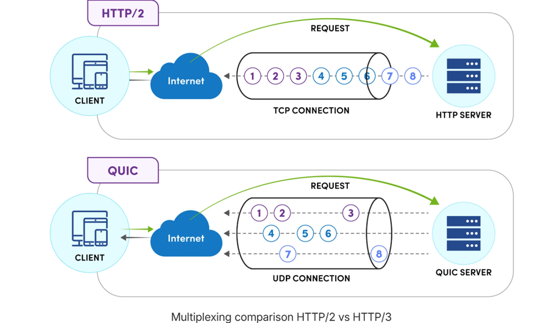
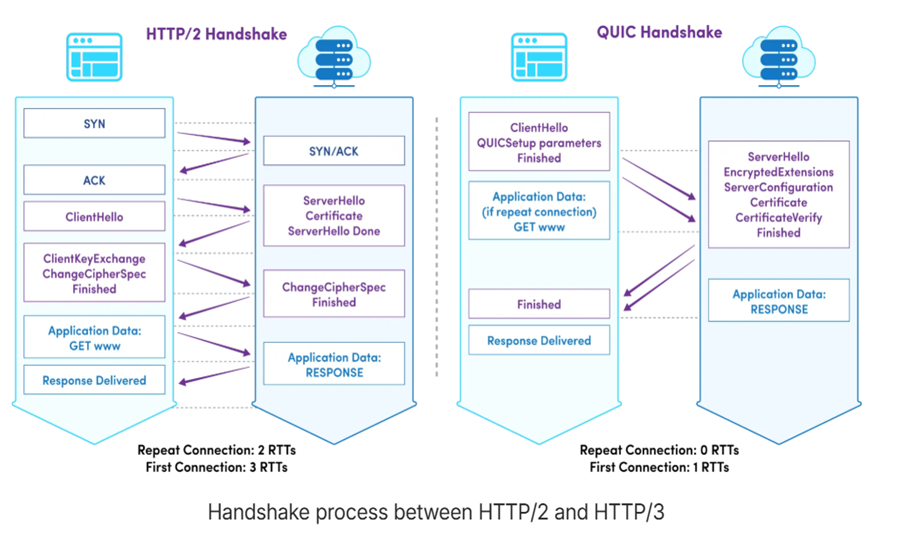

#  HTTP2 vs HTTP3 Quic

## What is HTTP?

**_HTTP_** stands for **_Hypertext Transfer Protocol_**. It is basically the rules/ protocol used to transfer data on the web.

##  HTTP 2.0 

> - HTTP 2.0 was published in **_2015_**.
>
> - The main purpose of HTTP 2.0 was to improve performance, which included **`reducing latency`**.
> - Multiple requests and responses are handled concurrently over a **`single TCP (Transmission Control Protocol)`** connection using _multiplexing_.
> - HTTP 2.0 introduced **`time limits to bunch requests`** and send all the bunched requests in one go.
> - If a request was slow, it was sent later with the next bunch. This solved the problem of **`head-of-line-blocking`** within a connection by allowing requests to be processed in parallel.
> - HTTP 2.0 also introduced **`Server Push`**, which is when a server would send data to the client that the client had not requested yet but is expected to request soon. For example, if a client requests an HTML file, it will send the JavaScript and CSS files associated with it.
> - HTTP 2.0 makes use of **`HPACK`**, which is a compression format used to reduce the size of HTTP headers. It compresses HTTP headers efficiently in order to improve performance and reduce latency.

##  HTTP 3.0 over QUIC and problems solved 

> - HTTP 3.0 was established in **_2019_** to solve issues that were present in HTTP 2.0.
>
> - HTTP 3.0’s significance is that it runs on **`QUIC (Quick UDP Internet Connection)`**. QUIC is designed to be fast and to easily switch between different networks. QUIC is built on **`UDP (User Datagram Protocol)`**.
> - In HTTP 2.0 head-of-line blocking is still present because of TCP. If a packet is lost or delayed, subsequent packets that arrive after it cannot be processed by the transport layer until the missing packet is retransmitted and received in the correct order.
> - In HTTP 3.0 **`each stream is independent`**, which allows streams to proceed without waiting for lost packets from other streams, making it resilient to packet loss and improving performance. If a packet is lost, only the affected stream waits for retransmission.
> - HTTP 3.0 also has **`stream prioritisation`** where some data is prioritised and can skip the line and be loaded first.
> - Below is an example of **`multiplexing between HTTP 2.0 and HTTP 3.0 over QUIC`**.
>   
> - **_HTTP 2.0_** uses TCP and in order to establish a TCP connection, a **`3-way handshake is required`**, which increases latency.
> - **_QUIC_** includes a **`cryptographic handshake`** when establishing a connection. This decreases the number of trips needed to establish a secure connection. See diagram below.
>   
