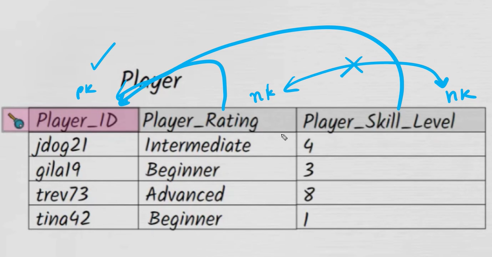
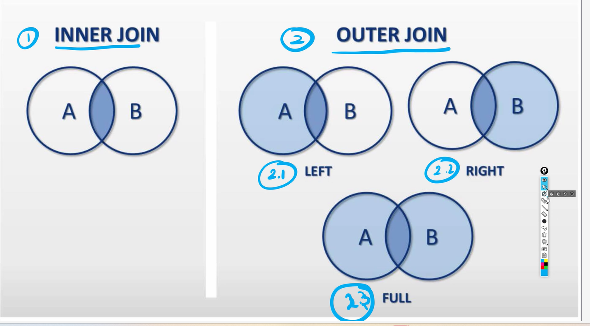

# Database - Why

- RAM is 10_000 times more faster than HDD
- RAM is 1000 times more faster than SSD
- RAM is volatile memory
- HDD is permanent memory
- Store database data on hard disk drive(HDD)
- ANSWER TO THE BIRTHDAY FAQ IN CLASS:
  - If the query( what they ask for) is frequent -> create a copy of the data to the RAM
  - First check if its in the RAM, if it's there then you can send it
  - Else if not there, then check HDD then send it
- LOADING ...-> COPYING EVERYTHING(RESOURCES) FROM HARD DRIVE TO RAM
- GTA: developers are loading parts of the game as you're playing

## FEATURES

1. Database - Frequently asked it will have it in the RAM
2. Querying becomes easier -> reads like English
3. CRUD- easy
4. Backups are inbuilt ( monthly/hourly backups)
5. Undo - easily (time limit)
   1. Event-driven database- you can redo/ go back to/roll back to a particular point
6. Performance
   1. you can fine tune how you ask for something (query optimisation)

# SQL VS NOSQL

- sql- stores it in table
- nosql->stores it as files/documents

## RELATIONAL:

-

# NOSQL

- radis captures things in RAM

# SQL

- is not case sensitive
- = IS CASE sensitive
- LIKE IS NOT CASE SENSITIVE
- % AT - means it should end with this
- AT% - means it should start with
- AN\_ -> WE ONLY WANT ONE LETTER WHERE IT'S MIssing
- distinct removes duplicate rows

  ## CLAUSES

  - WHERE
  - ORDER BY ( DEFAULT IS ASCENDING)
  - LIMIT ( gives you the specified number of rows)
  - skip the first set of numbers (offset)
  - limit 5 OFFSET 2 ( skip first 3 then get the following 5)
  - OFFSET

  ## PRACTICE MORE SQL

  - https://learn-sql.ragavkumarv.com/chapter/1

## Normalisation

- 1st-5th normal form
- database becomes more and more risk free
- data becomes more safer and safer ( Data safety increases)
- if data is not safe then it is prone to anomalies
- reducing anamolies
- UPDATE anomalies

### First Order Normalisation

1. Using row order to convey info is not permitted

   - don't hide info in column
   - be explicit about information

2. Do not mix data types within 1 column
3. Having a table without a primary key is not permitted
4. Reapeating groups are not permitted( can't have comma separated values)

   ### Primary Key:

   1. unique identifier
   2. cannot be null value
   3. only one PK in a table

   ### Composite key

   - combine two columns to make composit key

### Second Normal Form

1.  Each non-key attribute must depend on the `ENTIRE` primary key
2.  Should satisfy both 1st normal form and second normal form

### Third Normal Form

- every non-key in attribute in a table should depend on the key, the whole key, and nothing but the key.
- non-key to non-key no dependency
- 

## JOINS

- Inner join- common items in tables
- Left Outer join- common items and extra items from A
- Right Outer join- common items and extra items from B
- Manipulate Left Join to get Right Join ( Swap the table order)
- Full Outer Join - includes everything in both tables
