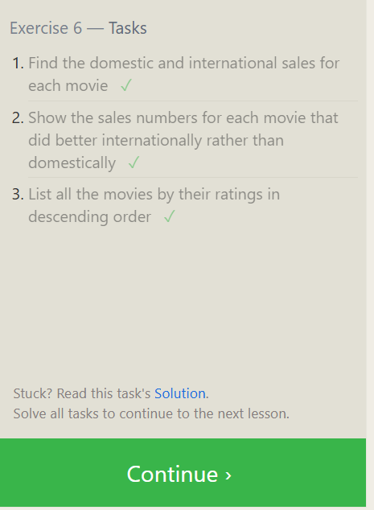
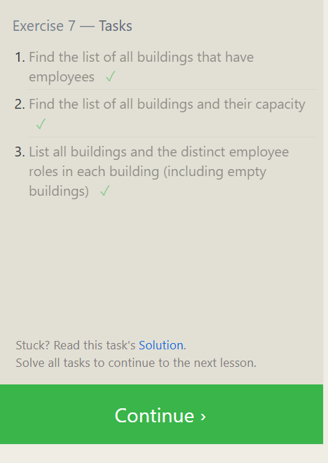
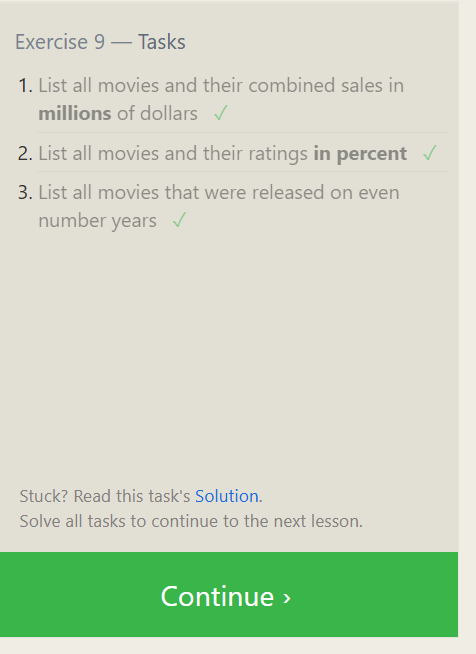
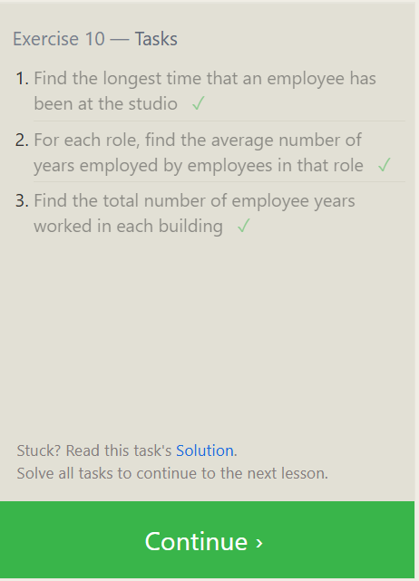
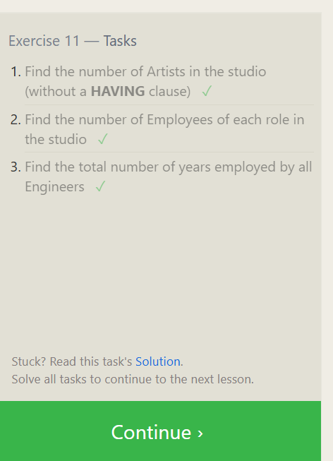
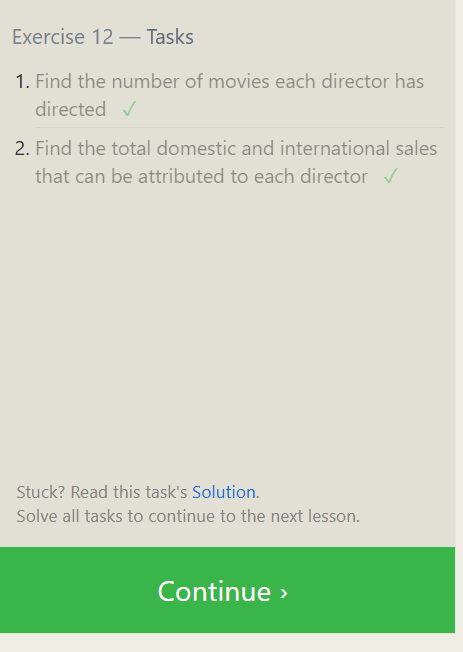
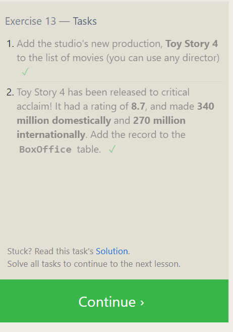
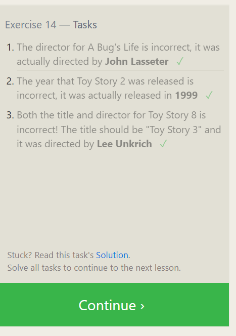

## Exercise 6 — Tasks

1. Find the domestic and international sales for each movie

```sql
SELECT *
from Movies
inner join Boxoffice
on movies.id= Boxoffice.movie_id
```

2. Show the sales numbers for each movie that did better internationally rather than domestically

```sql
SELECT *
from Movies
inner join Boxoffice
on movies.id= Boxoffice.movie_id
where International_sales>Domestic_sales

```

3. List all the movies by their ratings in descending order

```sql
SELECT *
from Movies
inner join Boxoffice
on movies.id= Boxoffice.movie_id
order by Rating desc

```



## Exercise 7 — Tasks

1. Find the list of all buildings that have employees

```sql

SELECT distinct Building
FROM employees
```

2. Find the list of all buildings and their capacity

```sql

SELECT *
FROM buildings

```

3. List all buildings and the distinct employee roles in each building (including empty buildings)

```sql
SELECT distinct buildings.Building_name, employees.Role
FROM Buildings
left join
employees
on buildings.Building_name= employees.Building

```



## Exercise 8 — Tasks

1. Find the name and role of all employees who have not been assigned to a building

```sql
select * from employees
where Building is null
```

2. Find the names of the buildings that hold no employees

```sql
select * from buildings
left join
employees
on buildings.Building_name= employees.Building
where Employees.role is null

```


## Exercise 9 — Tasks

1. List all movies and their combined sales in millions of dollars

```sql
SELECT title,((Domestic_sales+International_sales)/1000000) as Combined_Sales
FROM movies
left join Boxoffice
on movies.Id= Boxoffice.movie_Id
```

2. List all movies and their ratings in percent

```sql

SELECT title,((rating)\*10) as Combined_Sales
FROM movies
left join Boxoffice
on movies.Id= Boxoffice.movie_Id

```

3. List all movies that were released on even number years

```sql
SELECT title
FROM movies
left join Boxoffice
on movies.Id= Boxoffice.movie_Id
where movies.year%2==0

```



## Exercise 10 — Tasks

1. Find the longest time that an employee has been at the studio

```sql
SELECT max(years_employed) FROM employees;

```

2. For each role, find the average number of years employed by employees in that role

```sql
SELECT role, avg(years_employed) FROM employees group by role

```

3. Find the total number of employee years worked in each building

```sql
SELECT building,sum(years_employed) as Total_years from employees group by building

```



## Exercise 11 — Tasks

1. Find the number of Artists in the studio (without a HAVING clause)

```sql
SELECT count(role) as Artist FROM employees where role='Artist'

```

2. Find the number of Employees of each role in the studio

```sql

SELECT role, count(role) as Total FROM employees group by role

```

3. Find the total number of years employed by all Engineers

```sql
SELECT sum(years_employed) as Engineers_Total_Years_Employed FROM employees where role='Engineer' group by role

```



# Exercise 12 — Tasks

1. Find the number of movies each director has directed

```sql
SELECT director, count(title) as Number_of_Movies from movies group by director
```

2. Find the total domestic and international sales that can be attributed to each director

```sql
SELECT director, sum(domestic_sales)+ sum(international_sales) as Total_Sales
from movies
left join boxoffice on
movies.id = boxoffice.Movie_id
group by director
```



## Exercise 13 — Tasks

1. Add the studio's new production, Toy Story 4 to the list of movies (you can use any director)

```sql
insert into movies values(4, 'Toy Story 4', 'Inganathi Jacobs',2025,120)
```

2. Toy Story 4 has been released to critical acclaim! It had a rating of 8.7, and made 340 million domestically and 270 million internationally. Add the record to the BoxOffice table.

```sql
insert into boxoffice values (4, 8.7, 340000000,270000000);
```



## Exercise 14 — Tasks

1. The director for A Bug's Life is incorrect, it was actually directed by John Lasseter

```sql
Update movies
set director="John Lasseter"
where Id=2;

```

2. The year that Toy Story 2 was released is incorrect, it was actually released in 1999

```sql
select * from movies where title= "Toy Story 2";
update movies
set year='1999'
where title= "Toy Story 2";
```

3. Both the title and director for Toy Story 8 is incorrect! The title should be "Toy Story 3" and it was directed by Lee Unkrich

```sql
select * from movies where title= "Toy Story 8";
Update movies
set title='Toy Story 3',
director= "Lee Unkrich"
where title= "Toy Story 8";

```


