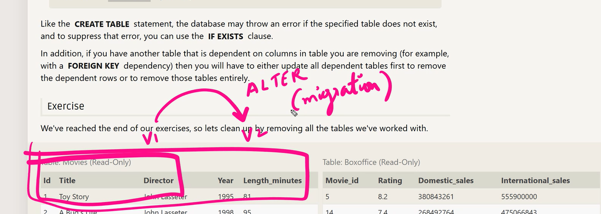
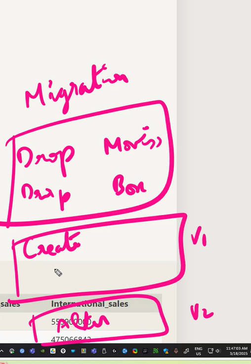

## DML

- Data Manipulation Language
- Delete and insert into columns

## DDL

- Data Definition Language

## Data Types

- 
- `Char`- few letters (10) -> M or F
- `VARCHAR`- sentences(250)
- `Text`- paragraphs
- Date and DateTime
- Blob -> stores any binary data
- We don't store images or videos directly in the database
- It takes up space
- They are stored in D/ =C drive and then path is provided in the DB

## Table constraints

1. PRIMARY KEY
   1. unique identifier
   2. cannot be null value
   3. only one PK in a table
2. AUTOINCREMENT
3. UNIQUE
   1. null is allowed
   2. can have mutiple uniques
4. NOT NULL
5. CHECK(EXPRESSION) -> Check is age>18 for driving test -> checks if value can go into column
6. FOREIGN KEY
   

## CREATE TABLE

- SCHEMA/ BLUEPRINT

# DON'T USE "" IN SSMS!!!

## CAN'T USE IF NOT EXISTS

# LEARN MORE ABOUT SQL

- group by tsql -> choose Microsoft option (Learn Microsoft)
- https://learn.microsoft.com/en-us/sql/t-sql/queries/select-group-by-transact-sql?view=sql-server-ver16

# IF EXISTS

- you want to release version 2
- you delete all tables and recreate them since the data won't be the same as version 1
- better to drop all tables and then do create and alter command for new version so that they don't face any problems
- one table to another -> MIGRATION
  
  
- migration file
