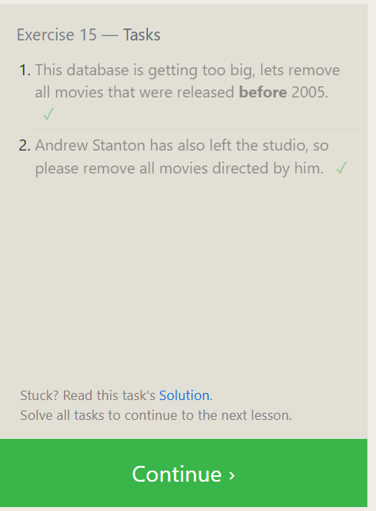

# Exercise 14 — Tasks

1. The director for A Bug's Life is incorrect, it was actually directed by John Lasseter

```sql
Update movies
set director="John Lasseter"
where title="A Bug's Life";
```

2. The year that Toy Story 2 was released is incorrect, it was actually released in 1999

```sql
SELECT * FROM movies
where title="Toy Story 2";

Update movies
set year= 1999
where title="Toy Story 2";

```

3. Both the title and director for Toy Story 8 is incorrect! The title should be "Toy Story 3" and it was directed by Lee Unkrich

```sql
SELECT * FROM movies
where title="Toy Story 8";
Update movies
set director="Lee Unkrich" , title = "Toy Story 3"
where title="Toy Story 8";
```


## Exercise 15 — Tasks

1. This database is getting too big, lets remove all movies that were released before 2005.

```sql
SELECT * FROM movies
where year<2005
Delete from movies
where year<2005;

```

2. Andrew Stanton has also left the studio, so please remove all movies directed by him.

```sql
SELECT * FROM movies
where director= "Andrew Stanton"
Delete FROM movies
where director= "Andrew Stanton";
```


