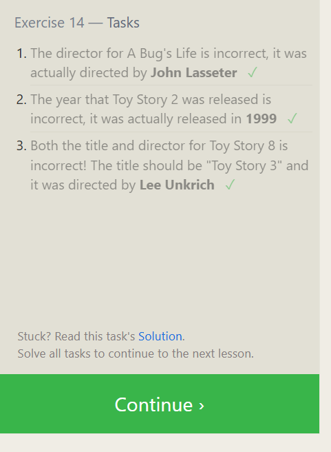

# Exercise 14 — Tasks

1. The director for A Bug's Life is incorrect, it was actually directed by John Lasseter

```sql
Update movies
set director="John Lasseter"
where title="A Bug's Life";
```

2. The year that Toy Story 2 was released is incorrect, it was actually released in 1999

```sql
SELECT * FROM movies
where title="Toy Story 2";

Update movies
set year= 1999
where title="Toy Story 2";

```

3. Both the title and director for Toy Story 8 is incorrect! The title should be "Toy Story 3" and it was directed by Lee Unkrich

```sql
SELECT * FROM movies
where title="Toy Story 8";
Update movies
set director="Lee Unkrich" , title = "Toy Story 3"
where title="Toy Story 8";
```



## Exercise 15 — Tasks

1. This database is getting too big, lets remove all movies that were released before 2005.

```sql
SELECT * FROM movies
where year<2005
Delete from movies
where year<2005;

```

2. Andrew Stanton has also left the studio, so please remove all movies directed by him.

```sql
SELECT * FROM movies
where director= "Andrew Stanton"
Delete FROM movies
where director= "Andrew Stanton";
```


## Exercise 16 — Tasks

Create a new table named Database with the following columns:
– Name A string (text) describing the name of the database
– Version A number (floating point) of the latest version of this database
– Download_count An integer count of the number of times this database was downloaded

This table has no constraints.

```sql
CREATE TABLE Database(
 Name text,
 Version float,
 Download_count int
);
```


## Exercise 17 — Tasks

1. Add a column named Aspect_ratio with a FLOAT data type to store the aspect-ratio each movie was released in.

```SQL
ALTER TABLE Movies
ADD Aspect_ratio FLOAT ;
```

2. Add another column named Language with a TEXT data type to store the language that the movie was released in. Ensure that the default for this language is English.

```sql
ALTER TABLE Movies
ADD Language TEXT
DEFAULT 'English';
```


## Exercise 18 — Tasks

1. We've sadly reached the end of our lessons, lets clean up by removing the Movies table

```SQL
DROP Table Movies;
```

2. And drop the BoxOffice table as well

```sql
DROP Table BoxOffice;
```


