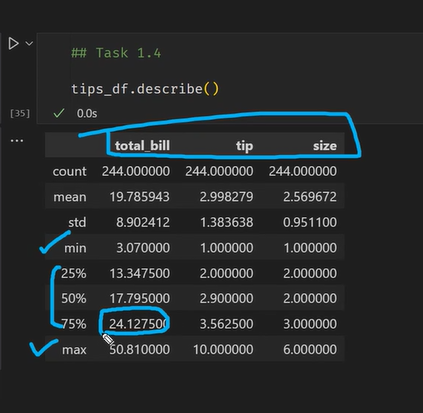
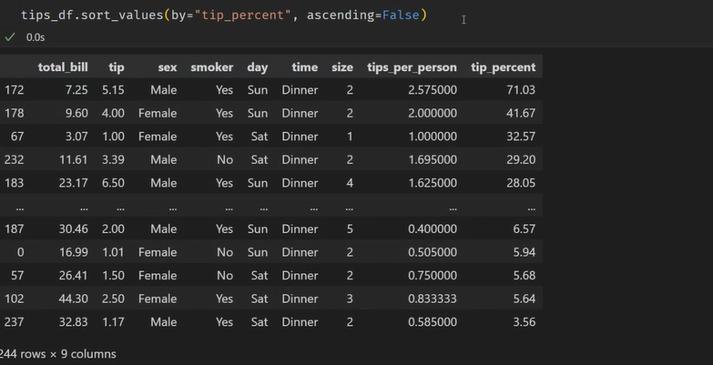
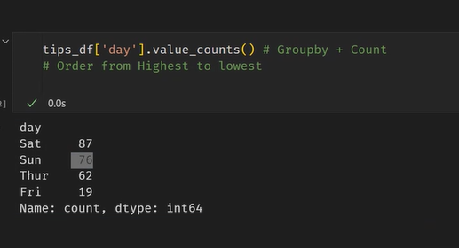

# Numpy Documentation

- https://numpy.org/doc/stable/reference/generated/numpy.char.count.html

# Pandas Documentation

- https://pypi.org/project/pandas/

numpy ndarray-> ndimensional array

# Strings in Pandas

- Pandas sees strings as objects

# CSV

- COMMA SEPARATED VALUES

# Default value for

- is 5

# Describe()

- 75% of people their bill is below 24.127500 (PERCENTILE/QUARTILE) | compare with min and max

## Sort in Pandas

- 

# `IMPORTANT`

- 
