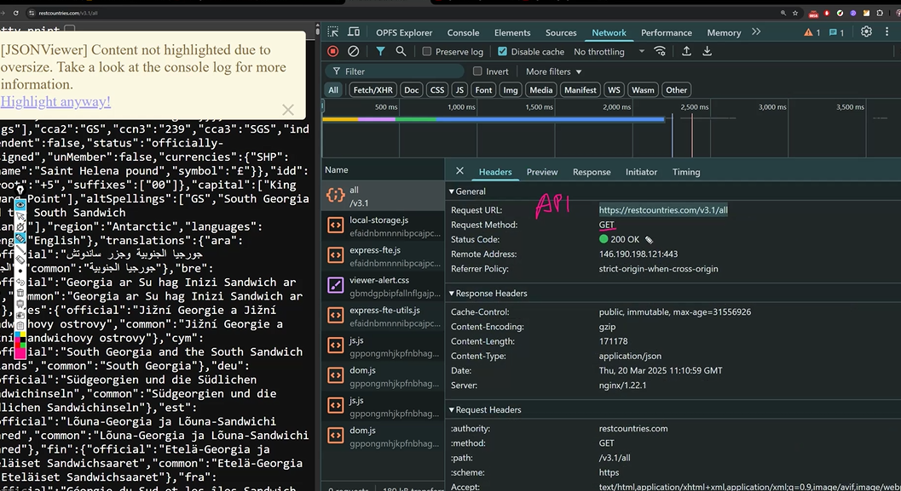

# Web Architecture

- Javascript doesn't understand Python and vice versa
- That's where JSON comes in , because it's the common language
- JSON is in string form, and every language has a string datatype, hence it is used
- JSON will be converted to Dictionary in Python, Object in Javascript and a HashMap in Java
- Medium of Data Transfer- JSON
- JSON is a universal language
- Before JSON there was XML

## Front-End

- React
- Angular
- JS

## Front-End: Mobile

- Kotlin (ANDROID)
- Swift (IOS)

# Front-End

- (Virtual Reality)VR/AR
- any string

## Back-End

- one back-end can talk to multiple front-ends

## GO and Flask

- can mix back-ends for performance ( micro-service Architecture)
- important code can be in GO (20%)
- then the rest is 80%
- GO is more performative
- Flask is more DX friendly

# Front End Interpretation

- doesn't care if it is mixed, as long as it gets JSON

# Monolith

- one back-end and one front-end

## Summary

- Universal language
- Same Back-end -> multiple Front-end
- Micro-service
- Loose coupling ( can change front-end or back-end and neither will be afffected)

# Leakages and SQL Injections

## APIs

- front-end get back-end
- back-end sends it using json
- url used to send it is an API
  
