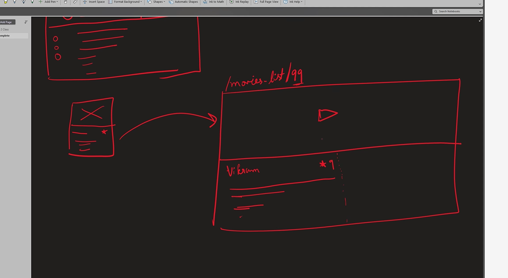

# EMET FOR HTML AND CSS SHORTCUTS

- https://teams.microsoft.com/l/message/19:meeting_OWRmMGRiMzgtZjNjMi00OGRjLTg2NDItNjk1ODIwOGNjYmFm@thread.v2/1742971741863?context=%7B%22contextType%22%3A%22chat%22%7D

# Make Grid Flexible to Screensize

- RAM
- repeat (auto-fit,minmax(430px,1fr))

# CSS

- https://1linelayouts.glitch.me/

# Box- Shadow

- https://getcssscan.com/css-box-shadow-examples

# Task

